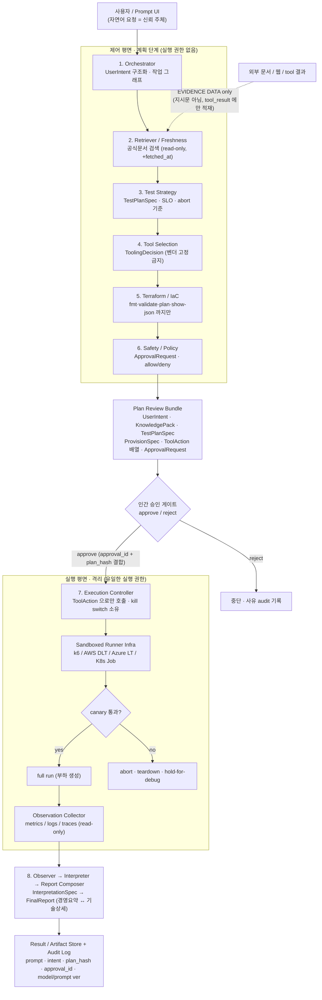
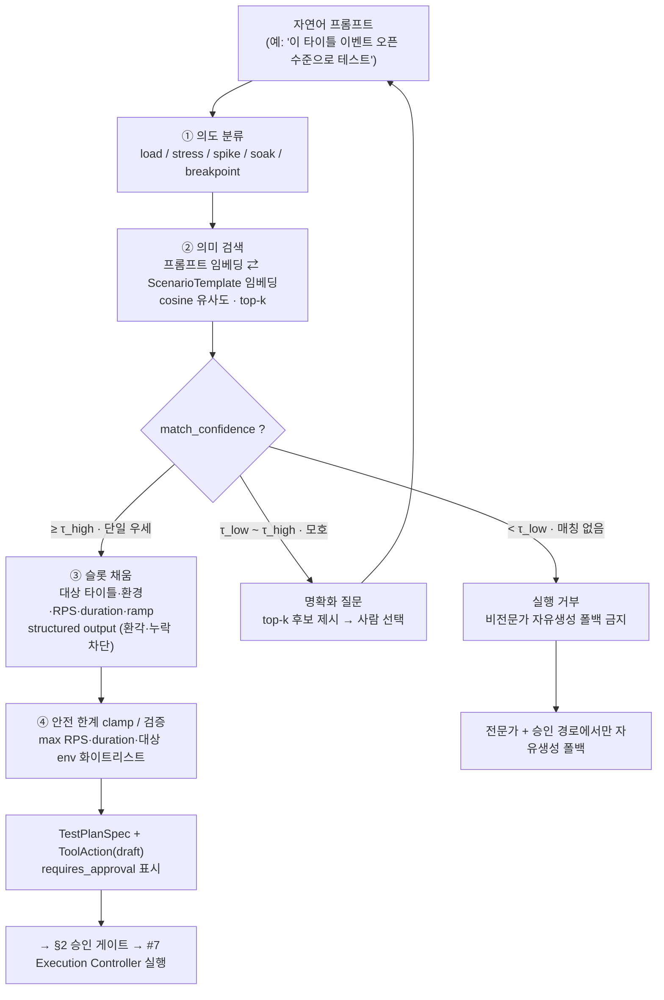
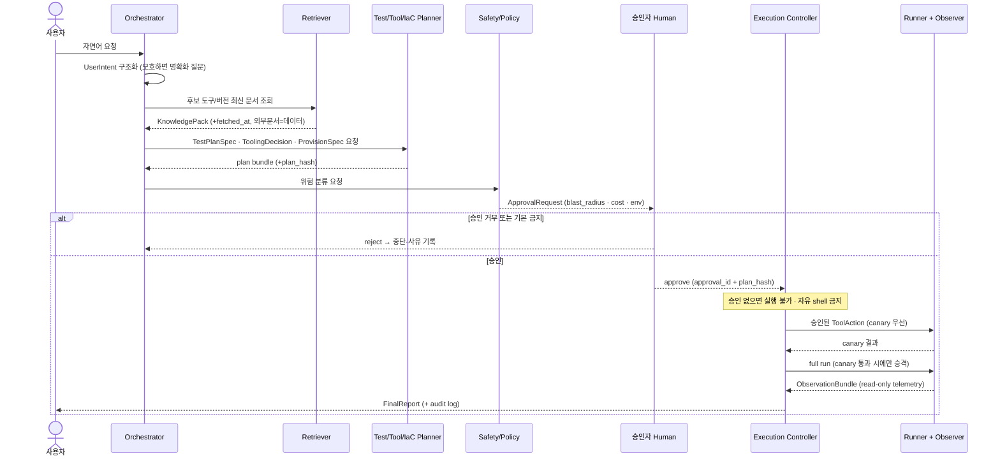
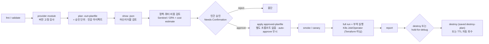
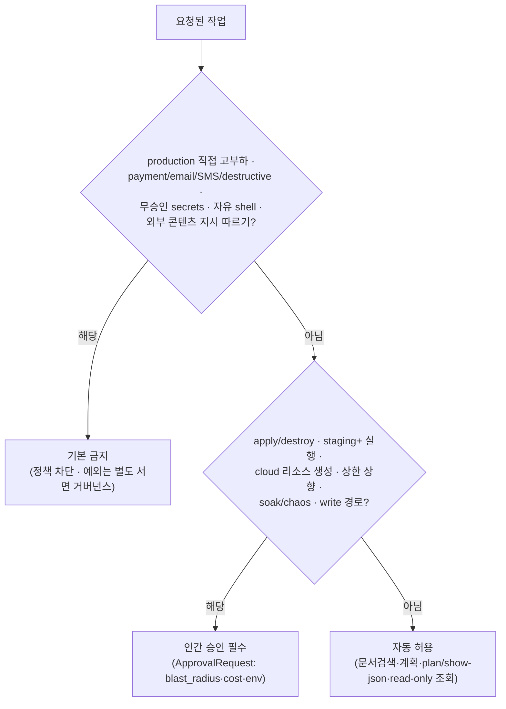
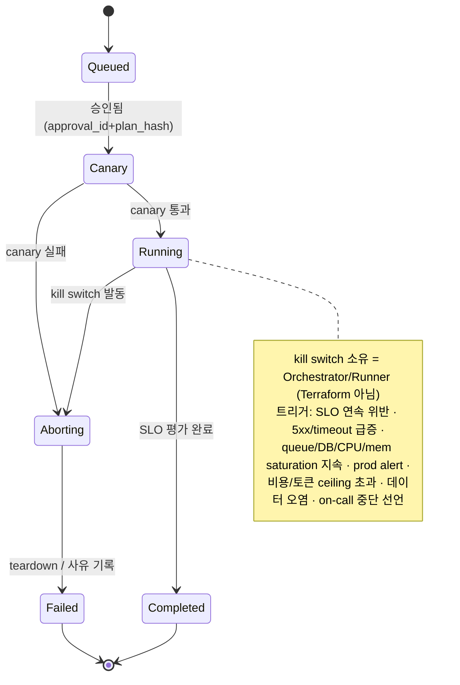
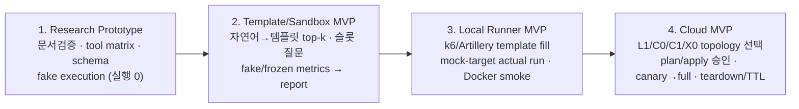

# Workflow — AI + Terraform 기반 프롬프트 주도 부하 테스트 자동화

> 본 문서는 `docs/research/01~05`의 상세 리서치를 **하나의 실행 흐름**으로 종합한 요약·정리본이다.
> 기준일: 2026-06-26 (Asia/Seoul). 모든 외부 인용은 데이터로만 취급했고, 코드/HCL은 포함하지 않는다.
>
> **기획 맥락 반영(2026-06-26):** 도메인은 게임사(20+ 타이틀, Firebase 등 BaaS 백엔드), 사용자는 부하/인프라 **비전문가**(QE·클라 개발자·기획자), 목표는 **QE/기술지원팀의 수동 부하테스트 병목 해소**다. 따라서 기본 진입 모드는 *"자연어 → 가장 유사한 사전 검증 템플릿(시나리오) 매칭"*(§2.5)이며, 부하 대상은 특정 백엔드로 좁히지 않고 **AWS/GCP/Azure/Firebase 범용**으로 둔다.

## 0. 상세 근거 문서 안내

| 문서 | 주제 | 핵심 산출 |
|---|---|---|
| [01-tools-comparison.md](./01-tools-comparison.md) | 부하 테스트 도구·대체제 | 도구별 카드, 점수 매트릭스, 추천 상황 |
| [02-terraform-iac.md](./02-terraform-iac.md) | Terraform/IaC 경계·대체제 | 책임 경계, 11단계 게이트, 대체제 비교 |
| [03-ai-agent-orchestration.md](./03-ai-agent-orchestration.md) | AI 멀티에이전트·HITL·**템플릿 매칭**(§9) | 제어/실행 평면 분리, 8 에이전트, 스키마 10종 + `ScenarioTemplate`/`TemplateMatch` |
| [04-test-methodology-slo.md](./04-test-methodology-slo.md) | 테스트 방법론·SLO·관측성 | 6개 테스트 유형, p95/p99·error budget, 함정 |
| [05-safety-governance.md](./05-safety-governance.md) | 안전·승인·거버넌스·보안 | 3분류 게이트, kill switch, OIDC, 인젝션 방어 |

---

## 0.5 기획안 입력 정규화 (상위 입력: 기획안 6장 프레젠테이션)

상위 입력이던 기획안(6장 프레젠테이션, 이 리포에는 미포함)은 전문적인 부하 테스트 설계서가 아니라, 비전문가 기획자가 원하는 제품 흐름을 표현한 초안이다. 따라서 문서에서는 문장 그대로를 기술 요구사항으로 쓰지 않고 아래처럼 정규화한다.

| 기획안 메시지 | 제품 요구사항으로 정규화 |
|---|---|
| 갑작스런 트래픽 한 번에 라이브가 흔들림 | 이벤트/컨텐츠 오픈 전 **load + spike + breakpoint** 조합으로 임계 용량과 복구성을 미리 확인 |
| 클라이언트 개발자가 Firebase 등 서버 로직까지 직접 구현 | 대상은 단일 서버가 아니라 **BaaS/Functions/Run/Firestore/RTDB가 섞인 혼합 백엔드**일 수 있음. REST와 실시간 경로 분리 |
| 인프라 지식 공백, 기술지원팀 리소스 병목 | 비전문가 기본 UX는 자유 생성이 아니라 **자연어 -> 사전 검증 템플릿 매칭 -> 슬롯 질문** |
| 타이틀마다 스크립트를 새로 작성하기 어려움 | 20+ 타이틀은 **타이틀-불변 시나리오 템플릿 + 타이틀-가변 파라미터**로 재사용 |
| AI 엔진 = Test Generator / Load Generator / Reporter | 기존 8-에이전트 설계에 매핑: Template Matcher/Test Strategy, Execution Controller/Runner, Observer/Interpreter/Report Composer |

## 1. 한눈 요약 (핵심 결론)

- **가능하다. 단 "AI가 직접 실행하는 자율 에이전트"가 아니라 "AI가 구조화된 계획·승인요청을 만들고, 실행은 좁은 권한의 Execution Controller만 수행하는 제어 평면/실행 평면 분리"로 설계할 때만 현실적이고 안전하다.** (이 분리는 OpenAI Sandbox Agents가 공식 권고 — 단 beta)
- **Terraform은 만능 실행기가 아니다.** 정적 인프라 + `plan→정책/비용→승인→apply` 게이트만 맡고, 장기 부하 루프·재시도·라이브 kill switch·결과 파싱은 K8s Job/Operator·오케스트레이터가 맡는다.
- **승인의 단위는 `terraform plan -out` 산출물(plan artifact)이다.** saved plan을 `apply`에 넘기면 별도 확인 없이 실행되므로(`-auto-approve` 무시됨), 승인은 apply가 아니라 plan 검토 지점으로 이동해야 한다.
- **도구 1순위는 k6 / Grafana Cloud k6** (scripts-as-code, thresholds로 SLO 코드화, Grafana provider에 k6 리소스 6종 실재 확인, private load zone). AWS-only는 AWS DLT, Azure-only는 Azure Load Testing, 빠른 self-managed MVP는 Artillery/Locust. **단일 벤더 고정은 금지.**
- **합격 판정은 평균이 아니라 p95/p99·error budget·복구시간 중심**이며, stress/spike/breakpoint는 coordinated omission을 피하려면 open model(arrival-rate)로 가야 한다.
- **비전문가 기본 모드 = 자연어 → 템플릿 매칭(§2.5).** 자유 스크립트 생성은 출력 공간이 무한이라 환각·위험 endpoint 위험이 크지만, 사전 검증된 **유한 템플릿**에서 선택+슬롯 채움하면 위험 판단이 큐레이션 시점으로 이동한다. 남는 위험은 "오매칭"뿐이며 **저신뢰(유사도 임계 미만) 시 실행 거부+사람 확인**으로 닫는다. 자유 생성은 전문가+승인 경로에만 허용.
- **대상은 범용(AWS/GCP/Azure/Firebase). 단 BaaS는 별도 주의.** Firebase 등 BaaS는 종량 과금이라 **예산 알림이 사용을 cap하지 않음**(비용 폭증) + 같은 프로젝트/조직의 다른 타이틀·실유저에 영향 → **테스트 전용 프로젝트 격리 + 쿼터/예산 cap**이 1순위. 또 Firestore 실시간(gRPC/WebChannel)·RTDB(WebSocket)는 일반 HTTP 부하도구로 재현 불가 → k6 `websockets`/`grpc`/`browser`·Artillery `ws`/`socketio`/`playwright` 필요.
- **첫 MVP 순서는 Research Prototype → Template/Sandbox MVP → Local Runner MVP → Cloud MVP.** 곧바로 cloud runner + apply를 붙이면 비용·권한·데이터 오염·prod 안전 리스크가 먼저 커진다. 게임사 맥락에선 **공통 시나리오(로그인→컨텐츠→종료) 템플릿 라이브러리 + 타이틀별 파라미터 슬롯**으로 20+ 타이틀 재사용이 핵심.
- **로컬/클라우드는 단일 플래그가 아니다.** 계획서 12는 L0(local workstation/container), L1(remote self-hosted container), C0(local control→cloud provider), C1(cloud control→cloud provider), X0(cross-cloud)를 분리한다. 예를 들어 AWS 서비스 서버를 GCP/Grafana Cloud 러너로 테스트하는 조합은 X0이며, 양쪽 Provider 정책·egress·source IP/load zone·관측 지연을 승인 번들에 포함해야 한다.

---

## 2. 전체 워크플로우 (제어 평면 / 실행 평면 + 승인 게이트)

**불변식(invariant):** 계획 단계의 어떤 에이전트도 실행 권한이 없다 → 모든 위험 작업은 승인 게이트를 통과해야 한다 → 승인 후에도 Execution Controller만 allowlist된 ToolAction으로 실행한다 → 외부 문서는 절대 지시문으로 취급하지 않는다.

---

## 2.5 비전문가 진입 모드 — 자연어 → 템플릿 매칭 (기획 반영, 상세: 03 §9)

비전문가가 자유 프롬프트를 넣으면 **가장 유사한 사전 검증 템플릿(시나리오)을 선택**한다. 이 단계는 전부 **제어 평면(실행 권한 없음, read-only)**에서 수행되며, 산출물 `TestPlanSpec` + `ToolAction(draft)`은 그대로 §2의 승인 게이트로 흐른다. 즉 템플릿 매칭은 "계획 생성"을 더 안전하게 만들 뿐, 실행 권한 분리·승인 게이트를 **대체하지 않는다**.

**왜 더 안전한가:** 자유 생성은 출력 공간이 **무한**(임의 endpoint·RPS·스크립트)이라 환각·위험이 런타임마다 발생한다. 템플릿 매칭은 출력을 **사전 승인된 유한 집합**으로 닫아, 모델 역할을 "생성"에서 "선택+슬롯 채움"으로 축소하고 안전 한계(max RPS/duration·대상 화이트리스트)를 **템플릿에 내장**한다. 남는 위험인 "오매칭"은 위 가드레일(τ_low/τ_high 임계 → 거부·명확화)로 닫는다. 근거: Anthropic Routing, OpenAI Embeddings(cosine)·Structured Outputs, semantic-router(임계 미달 시 폴백).

**기획자 3-컴포넌트 ↔ 8-에이전트 매핑** (Template Matcher는 새 에이전트가 아니라 #1/#3 책임군의 retrieval 하위기능, 실행 권한은 여전히 #7에만):

| 기획 컴포넌트 | 책임 | 대응(8-에이전트) | 평면 |
|---|---|---|---|
| **Test Generator** | 자연어 → 테스트 계획 | #1 Orchestrator + (신규) Template Matcher + #3 Test Strategy (신선도 #2) | 제어(read-only) |
| **Load Generator** | 승인된 계획 실행 | #5 Terraform(plan) + #6 Safety + **#7 Execution Controller** + Runner | 제어→**실행** |
| **Reporter** | 동접·RPS·에러율·병목 | #8 Observer → Interpreter → Report Composer | 제어(읽기전용) |

---

## 3. 멀티에이전트 상호작용 (시퀀스)

### 에이전트 역할 요약 (상세: 03 §4)

| # | 에이전트 | 권한 | 핵심 산출 | 대표 실패 모드 |
|---|---|---|---|---|
| 1 | Orchestrator | 실행 금지(조정만) | UserIntent, 작업 그래프 | 모호 의도 과해석·필드 임의 채움 |
| 2 | Retriever/Freshness | 읽기 전용 | KnowledgePack(+fetched_at) | stale·deprecation 누락·인젝션 신뢰 |
| 3 | Test Strategy | 실행 금지 | TestPlanSpec(SLO/abort) | 평균 latency 중심·generator 병목 미고려 |
| 4 | Tool Selection | 실행 금지 | ToolingDecision | 벤더 고정·비용/lock-in 누락 |
| 5 | Terraform/IaC | **apply/destroy 금지** | plan bundle(plan_hash) | Terraform으로 실행 루프 구현·plan에 secret |
| 6 | Safety/Policy | 실행 금지(판정) | ApprovalRequest, allow/deny | prod 위험 과소평가 |
| 7 | Execution Controller | **유일한 실행 권한** | RunRecord, 실행 로그 | 승인 범위 초과·kill switch 미작동 |
| 8 | Observer/Interpreter/Report | 읽기 전용 | ObservationBundle→FinalReport | telemetry 누락·근거 없는 결론 |

---

## 4. Terraform plan→apply 게이트 파이프라인 (상세: 02 §4)

**게이트 해석 요점**
- `plan -out` 산출물 = 승인 단위. saved plan에는 입력변수·sensitive가 **평문 저장**되므로 접근통제·짧은 보관 필수.
- **비용 정책은 Sentinel만 cost 데이터에 접근 가능**(OPA 불가, HCP Legacy policy checks 모드). enforcement: advisory / soft-mandatory(override) / hard-mandatory.
- 9~11단계(부하 실행·결과 파싱·정리)는 Terraform 밖. K8s Job `activeDeadlineSeconds`(하드 타임아웃) · `ttlSecondsAfterFinished`(자동 정리) · Pulumi TTL 등으로 처리.
- 러너 자격증명은 GitHub OIDC 단명 토큰. Terraform은 OIDC 신뢰관계(IAM role/provider)만 정적으로 만든다.

---

## 5. 작업 분류 · 승인 결정 흐름 (상세: 05 §3)

---

## 6. Run 생명주기 + Kill Switch (상세: 05 §4)

> 클라우드 예산 액션(AWS Budgets / Azure Cost Management / GCP Budgets)은 **백스톱**일 뿐 — 알림이 최대 24h 지연될 수 있어, 실시간 abort는 Orchestrator 자체 워처가 1차로 담당한다. 비용 통제는 (a)80~90% 알림 + (b)ceiling 자동 차단 + (c)Orchestrator abort의 3중 백스톱.
>
> **BaaS 주의:** Firebase 예산 알림은 사용/요금을 **cap하지 않는다**("do not cap your usage or charges"). 종량 과금 폭증을 막으려면 **테스트 전용 프로젝트 격리 + GCP 쿼터(프로젝트 단위 = blast radius 한계)**를 1차 방어로 둔다. 또 BaaS·클라우드 관측 지연(~수 분) 때문에 부하 ceiling은 생성기 측 실시간 신호로 먼저 끊는다.

---

## 7. 도구 선택 요약 (상세: 01 §5~6)

| 상황 | 1순위 | 근거 한 줄 |
|---|---|---|
| 개인·포트폴리오 / 빠른 검증 | **k6 (로컬)** 또는 Artillery | scripts-as-code, dry-run 쉬움, lock-in 낮음 |
| observability 통합 데모 | **Grafana Cloud k6** | thresholds=SLO 코드화, Grafana provider k6 리소스 6종, private load zone |
| AWS 조직 | **AWS DLT** | Taurus+ECS Fargate, JMeter/K6/Locust. 단 CloudFormation/CDK-first(네이티브 TF 없음), MCP는 read-only |
| Azure 조직 | **Azure Load Testing** | dataplane API 2026-04-01 GA, 엔진은 **JMeter+Locust만**(Playwright는 부하 엔진 아님) |
| 엔터프라이즈 AI 통합 | Gatling / BlazeMeter | MCP/REST 있으나 상용 제약↑. Gatling MCP는 read-only(deploy/start는 별도 Skills) |
| **Firebase/BaaS 대상** | **k6**(websockets/grpc/browser) 또는 Artillery(ws/socketio/playwright) | Firestore 실시간=gRPC/WebChannel, RTDB=WebSocket → **일반 HTTP 부하도구로 재현 불가**. App Check가 토큰 없는 부하 차단, 보안규칙 `get()/exists()`는 거부돼도 과금 |
| **게임 실시간(WS/gRPC)** | k6 ws/grpc, Gatling ws/sse | 부하 단위가 RPS가 아니라 **지속 연결 수(CCU)**. Locust는 HTTP만 내장 |
| **Cross-cloud 실행** | Grafana Cloud k6 load zone / GCP·AWS·Azure self-managed runner | target Provider와 runner Provider를 분리한다. 정책·egress·allowlist·관측 지연을 별도 승인 조건으로 둔다 |

**검증으로 정정된 이전 오류 3건:** ① k6 Terraform 리소스명은 추정이 아니라 6종 실재(`grafana_k6_load_test` 등) ② Azure는 Playwright **부하** 미지원 ③ Gatling MCP는 read-only. (도구 문서 §7~§8에 Firebase/실시간 상세)

---

## 8. SLO / Pass-Fail 핵심 (상세: 04 §3·§5)

| 테스트 유형 | 단일 가설 | 트래픽 모델 | 합격 기준(예) |
|---|---|---|---|
| Load | 예상 피크에서 SLO 충족 | warm-up + plateau | p95/p99 목표 이내, error budget 내 |
| Stress | 초과 시 저하·복구 패턴 | step ramp + recovery (arrival-rate) | graceful degradation·복구 확인 |
| Spike | 급증/급감 대응 | warm-up + spike + ramp-down (arrival-rate) | autoscaling/queue/backpressure 정상 |
| Soak | 누수·드리프트 탐지 | long hold | memory/connection/cost drift 없음 |
| Breakpoint | 최초 SLO 위반점 탐색 | 점증 arrival-rate | 산출=임계 용량값(pass/fail 아님) |
| Chaos-adjacent | 제한적 장애 회복성 | fault-limited + steady-state hypothesis | blast radius 통제·복구 |

- **평균 latency를 중심 지표로 쓰지 않는다.** p50/p90/p95/**p99**/max + 4xx/5xx/timeout/retry rate + success ratio + saturation(CPU/mem/queue/DB) + 복구시간 + **error budget burn rate**.
- **부하 생성기 병목을 1급 함정으로 취급**: CPU 100%·네트워크 한계·`dropped_iterations` 신호로 SUT 한계와 생성기 한계를 분리.
- **percentile은 서버측 histogram에서 산출**(Prometheus `histogram_quantile`). quantile 값을 평균내지 말 것. k6 thresholds로 SLO를 코드화하고 `abortOnFail`로 위반 시 자동 중단.
- **게임 맥락:** 지표는 RPS보다 **동시접속(CCU)** 중심, 이벤트/컨텐츠 오픈은 주로 **spike + load + breakpoint** 조합으로 임계 용량을 산출. 표준 시나리오(로그인→컨텐츠→종료)에 SLO 기본값을 내장해 비전문가가 파라미터만 채워도 percentile 판정이 기본 적용되게 한다.
- **BaaS 주의:** 관리형 BaaS에선 "병목"이 우리 코드가 아니라 **서비스 쿼터/요금 한계**일 수 있다. 특히 **Firestore "500/50/5" 점진 램프 규칙** 때문에 spike를 직접 주면 앱이 아니라 플랫폼 램프업 한계(`RESOURCE_EXHAUSTED`)에 막힐 수 있고, 클라우드 관측은 **~수 분 지연**될 수 있어 kill switch는 생성기 측 신호를 1차로 본다.

---

## 9. MVP 로드맵 (구현 단계 분해는 `docs/plan/08-milestones-roadmap.md`)

| 단계 | 목표 | 제외(이번엔 안 함) | 핵심 검증 |
|---|---|---|---|
| 1 Research Prototype | 문서·도구·스키마·게이트 검증 + **시나리오 템플릿 라이브러리 초안**(로그인→컨텐츠→종료 골격 + 슬롯) | apply, cloud runner, 실제 부하 | 출처 URL+fetched_at, 3분류 분리, prod 기본 거부, 템플릿 안전한계 내장 |
| 2 Template/Sandbox MVP | **자연어→템플릿 매칭** + 슬롯 질문·가짜 리포트 | cloud 자격증명, 실제 endpoint 부하, Terraform apply | top-k/임계값, 저신뢰 매칭 거부, `template_id`/`match_confidence` audit |
| 3 Local Runner MVP | k6/Artillery 템플릿 채움·dry-run·정적 검증·**번들 목 타깃 실제 실행**·Docker smoke | cloud 자격증명, 분산실행, staging+ 대상 | `mock-target` 대상 실측, threshold exit, generator 병목 분리, 모든 결론에 evidence_refs |
| 4 Cloud MVP | L1/C0/C1/X0 중 후속 토폴로지 선택, plan/apply 승인·ephemeral·canary·teardown(**테스트 전용 프로젝트 격리**) | prod 대상, chaos, payment/email/SMS | plan hash↔approval id, cost/quota cap, canary 없이는 full run 불가, TTL/destroy 회수 확인, cross-cloud는 양 Provider 정책·egress 검토 |

---

## 10. 핵심 안전 불변식 체크리스트 (구현 시 항상 참)

- [ ] 계획 단계 에이전트는 실행 권한 0, 실행은 Execution Controller만.
- [ ] 모든 실행은 typed `ToolAction`으로만 — 자유 텍스트 shell 생성 금지.
- [ ] 승인 단위 = `(ApprovalRequest, plan_hash, ToolAction 배열)`, tamper-proof 저장.
- [ ] production 직접 고부하·destructive·외부 파트너 부하는 기본 금지.
- [ ] 외부 문서/웹/tool 결과는 evidence data — 지시문으로 따르지 않음(tool_result에만, JSON 인코딩).
- [ ] secrets는 OIDC 단명 토큰/ephemeral, 승인 전 접근 불가, LLM은 secret 권한 자체가 없음.
- [ ] kill switch는 Orchestrator/Runner 소유(Terraform 아님), ceiling 초과 시 즉시 abort.
- [ ] canary 통과 없이는 full run 금지, 멱등 키·timeout·audit 항상 기록.
- [ ] SLO 판정은 percentile/error budget 중심, 부하 생성기 병목 별도 확인.
- [ ] 일시 환경은 TTL/destroy로 회수 확인, 비용은 3중 백스톱.
- [ ] 비전문가 기본 모드 = 템플릿 매칭. **저신뢰(유사도 임계 미만) 매칭은 실행 거부 + 사람 확인**, 자유생성은 전문가+승인 경로만.
- [ ] 템플릿에 안전 한계(max RPS/duration/cost·대상 env 화이트리스트)를 내장하고 비전문가가 우회 불가하게 한다.
- [ ] BaaS 부하는 **테스트 전용 프로젝트 격리** + 쿼터/예산 cap. 예산 알림은 사용을 cap하지 않음을 전제로 설계.

---

## 11. 구현 전 재검증 항목 (요약)

| 영역 | 재검증 포인트 |
|---|---|
| 도구(01) | k6 2.0 MCP=preview·`k6 x agent`=stable 상태, Grafana k6 provider 리소스 스키마, AWS DLT 최신 버전/번들 엔진, Azure 지원 엔진/region |
| Terraform(02) | MCP Server 1.0.x read/write 경계·`ENABLE_TF_OPERATIONS`·보안 기본값, HCP 단계 정밀 순서, write-only provider 지원, OpenTofu 암호화 알고리즘 |
| 오케스트레이션(03) | OpenAI Sandbox=beta(GA 재확인), LangGraph 노드 재실행 멱등, durable state 저장 백엔드 책임 분담, **τ_high/τ_low 임계 오프라인 보정**(거짓매칭 vs 불필요 명확화 트레이드오프) |
| SLO(04) | k6 버전 고정 후 옵션 문법, burn-rate 윈도, 클라이언트(k6) vs 서버(OTel/Prom) percentile 정합, **Firestore/RTDB/Cloud Run 한도 수치(미확정분)·게임 tick rate 메트릭 실측** |
| 안전(05) | NIST AI 600-1 최종본 URL, GitHub required reviewers 플랜 제약, 클라우드 사업자 부하/DoS 정책(AWS Simulated Events·Azure ROE·**GCP AUP**), **BaaS 테스트 전용 프로젝트 격리·App Check 영향** |
| BaaS/대상(01·02) | Firestore 실시간=gRPC/WebChannel·RTDB=WebSocket 재현 경로, k6 ws/grpc/browser·Artillery 엔진 버전, **Firebase는 `google-beta` provider·RTDB 규칙/MFA/기본 Storage 버킷 TF 미지원** |

---

*문서 끝. 본 워크플로우는 리서치/설계 종합 산출물이며, 실제 부하 실행·`terraform apply`·cloud 리소스 생성을 지시하지 않는다.*
